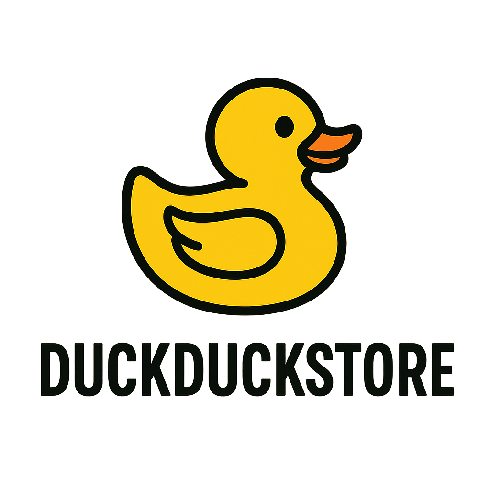

# 🦆 DuckDuckStore

<div align="center" background-color="#f8f9fa" style="padding: 20px; border-radius: 10px; box-shadow: 0 4px 8px rgba(0,0,0,0.1);">
  
</div>

<p align="center">
  <strong>E-commerce per paperelle di gomma - Progetto TSW 2025</strong>
</p>

<p align="center">
  Università degli Studi di Salerno - Anno Accademico 2024/2025<br>
  Corso di Tecnologie Software per il Web
</p>

---

## 📝 Descrizione

DuckDuckStore è una piattaforma e-commerce completa sviluppata per la vendita di paperelle di gomma da collezione. Il progetto è stato realizzato come parte dell'esame di Tecnologie Software per il Web (TSW) presso l'Università degli Studi di Salerno, Fisciano.

La piattaforma offre un'esperienza di shopping online intuitiva, con un catalogo di prodotti organizzato per categorie tematiche (Natale, Fantasy, Spaventose, Professioni) e un sistema completo di gestione ordini e pagamenti.

## ✨ Funzionalità Principali

### 👤 Area Utente
- **Registrazione e Login** - Sistema di autenticazione sicuro con password hash SHA-512
- **Profilo Personale** - Gestione dati personali e saldo account
- **Carrello Dinamico** - Aggiunta/rimozione prodotti con aggiornamento in tempo reale
- **Checkout Completo** - Processo di acquisto con:
  - Inserimento indirizzo di consegna
  - Gestione pagamento con carta di credito
  - Generazione fattura PDF
- **Storico Ordini** - Visualizzazione completa degli ordini effettuati
- **Ricerca Avanzata** - Filtri per categoria, prezzo e disponibilità

### 👨‍💼 Area Amministratore
- **Dashboard Amministrativa** - Pannello di controllo dedicato
- **Gestione Prodotti**:
  - Creazione nuovi prodotti
  - Modifica informazioni esistenti
  - Gestione inventario e sconti
- **Gestione Ordini** - Visualizzazione e monitoraggio ordini utenti
- **Gestione Utenti** - Lista completa utenti registrati

### 🎨 Caratteristiche Tecniche
- **Design Responsive** - Interfaccia ottimizzata per desktop e mobile
- **Filtri di Accesso** - Controllo accessi per aree riservate
- **Gestione Errori** - Pagine di errore personalizzate
- **Database Relazionale** - Schema ottimizzato con indici per performance

## 🛠️ Stack Tecnologico

### Backend
- **Java 11** - Linguaggio principale
- **Jakarta Servlet 6.0** - Gestione richieste HTTP
- **JSP/JSTL** - Rendering dinamico delle pagine
- **JDBC** - Connessione database
- **Apache Tomcat 10** - Application server

### Frontend
- **HTML5/CSS3** - Struttura e stile
- **JavaScript** - Interattività client-side
- **Design System Custom** - Framework CSS proprietario

### Database
- **MySQL 8.0** - Database relazionale
- **Connection Pool** - Ottimizzazione connessioni

### DevOps
- **Docker & Docker Compose** - Containerizzazione
- **Maven** - Build automation
- **Git** - Version control

## 📁 Struttura del Progetto

```
DuckDuckStore/
├── 📄 pom.xml                 # Configurazione Maven
├── 🐳 docker-compose.yml       # Orchestrazione container
├── 🐳 Dockerfile              # Immagine applicazione
├── 🗄️ db.sql                  # Schema e dati iniziali database
│
├── 📂 src/main/
│   ├── 📂 java/
│   │   ├── 📂 controller/     # Servlet (MVC Controller)
│   │   │   ├── HomeServlet.java
│   │   │   ├── LoginServlet.java
│   │   │   ├── CartServlet.java
│   │   │   ├── CheckoutServlet.java
│   │   │   └── ...
│   │   ├── 📂 model/          # Classi modello e DAO
│   │   │   ├── Utente.java
│   │   │   ├── Prodotto.java
│   │   │   ├── Ordine.java
│   │   │   ├── UtenteDAO.java
│   │   │   ├── ProdottoDAO.java
│   │   │   └── ...
│   │   └── 📂 filter/         # Filtri di sicurezza
│   │       └── AccessControlFilter.java
│   │
│   └── 📂 webapp/
│       ├── 📂 WEB-INF/
│       │   ├── 📄 web.xml     # Configurazione webapp
│       │   ├── 📂 admin/      # JSP area amministratore
│       │   └── 📂 results/    # JSP area pubblica
│       ├── 📂 css/            # Fogli di stile
│       ├── 📂 js/             # Script JavaScript
│       └── 📂 images/         # Risorse grafiche
```

## 🚀 Guida all'Installazione

### Prerequisiti
- Docker e Docker Compose installati
- Git per clonare il repository
- Porta 8080 e 3306 disponibili

### Installazione Rapida

```bash
# 1. Clonare il repository
git clone https://github.com/GrandeVx/DuckDuckStore.git

# 2. Navigare nella directory
cd DuckDuckStore

# 3. Avviare l'applicazione
docker-compose up --build

# 4. Accedere all'applicazione
# Browser: http://localhost:8080
```

### Modalità Sviluppo

Per avviare l'applicazione in modalità sviluppo con hot-reload:

```bash
docker-compose -f docker-compose.dev.yml up
```

## ⚙️ Configurazione

### Variabili d'Ambiente

Le seguenti variabili possono essere configurate nel file `docker-compose.yml`:

| Variabile | Descrizione | Valore Default |
|-----------|-------------|----------------|
| `MYSQL_HOST` | Host database MySQL | mysql |
| `MYSQL_PORT` | Porta database | 3306 |
| `MYSQL_DB` | Nome database | DuckDuckStore |
| `MYSQL_USER` | Utente MySQL | root |
| `MYSQL_PASSWORD` | Password MySQL | (configurata) |

### Database

Il database viene automaticamente inizializzato al primo avvio tramite lo script `db.sql` che:
- Crea lo schema del database
- Definisce le tabelle (utenti, prodotti, ordini)
- Inserisce dati di esempio
- Configura gli indici per ottimizzare le performance

## 📊 Schema Database

### Tabella `utenti`
- Gestione account utenti e amministratori
- Password criptate con SHA-512
- Saldo account per acquisti

### Tabella `prodotti`
- Catalogo prodotti con categorie
- Gestione inventario e sconti
- Contatore acquisti per statistiche

### Tabella `ordini`
- Storico completo ordini
- Informazioni consegna
- Dati pagamento (criptati)
- Scontrino in formato JSON

## 🔐 Sicurezza

- **Autenticazione** - Sistema di login con sessioni
- **Password Hash** - SHA-512 per storage sicuro
- **Access Control** - Filtri per aree riservate
- **SQL Injection Prevention** - PreparedStatement
- **XSS Protection** - Escape HTML nei form
- **HTTPS Ready** - Configurabile per produzione

## 👥 Credenziali di Test

### Amministratori
| Email | Password |
|-------|----------|
| vito@gmail.com | vito |
| vittorio@gmail.com | vittorio |
| matteo@gmail.com | matteo |

## 📈 Funzionalità Future

- [ ] Sistema di recensioni prodotti
- [ ] Wishlist personalizzata
- [ ] Notifiche email ordini
- [ ] Dashboard analytics avanzata
- [ ] API REST per integrazioni
- [ ] Sistema di coupon sconto
- [ ] Chat supporto clienti
- [ ] Multi-lingua

## 🤝 Contributi

Progetto sviluppato per l'esame di TSW presso UNISA. Per suggerimenti o segnalazioni:

- Apri una [Issue](https://github.com/GrandeVx/DuckDuckStore/issues)
- Crea una Pull Request
- Contatta il team di sviluppo

## 📜 Licenza

Questo progetto è stato sviluppato a scopo didattico per l'Università degli Studi di Salerno.

## 👨‍💻 Autori

Progetto realizzato da studenti del corso di Tecnologie Software per il Web - Anno Accademico 2024/2025

---

<p align="center">
  Made with ❤️ at UNISA Fisciano
</p>